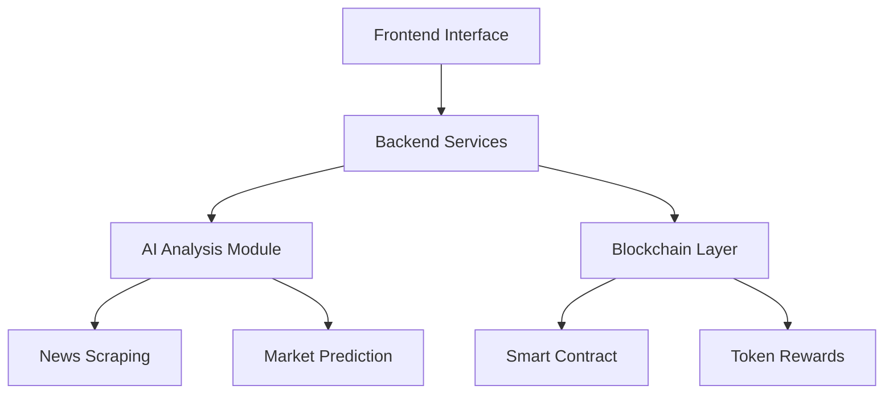

# NewsWave

<div align="center">


[](https://github.com/newswave/newswave/stargazers)
[](LICENSE)
[](https://x.com/NewsWaveSOL)

[Official Website](https://newswave.cc)

An AI-powered WEB3 news analysis tool built on Solana blockchain

</div>

## 📖 Overview

NewsWave leverages artificial intelligence to scrape and analyze WEB3-related news in real-time, providing market predictions and rewarding user participation through the WAVE token. Our goal is to provide cryptocurrency investors and WEB3 enthusiasts with an intelligent and efficient news analysis platform.

## 🌟 Core Features

- 🤖 Real-time WEB3 news scraping and analysis
- 📊 AI-driven market predictions (15min, 30min, 4h, 1d)
- 🗳️ User voting and reward system
- 💰 WAVE token incentive mechanism
- ⚡ Solana blockchain integration

## 🛠️ Tech Stack

- Frontend: React.js
- Backend: Node.js + Python
- Blockchain: Solana (Rust)
- AI: TensorFlow/PyTorch
- Database: MongoDB

## 🔧 System Architecture



## 🚀 Quick Start

### Prerequisites

- Node.js >= 16
- Python >= 3.9
- Rust
- Solana CLI
- MongoDB
- Docker & Docker Compose (可选)

### Installation

1. Clone the repository
```bash
git clone https://github.com/your-username/newswave.git
cd newswave
```

2. Install dependencies
```bash
# Install frontend dependencies
cd frontend
npm install

# Install backend dependencies
cd ../backend
pip install -r requirements.txt

# Install smart contract dependencies
cd ../contracts
cargo build
```

3. Configure Environment Variables
```bash
cp .env.example .env
# Edit .env file and fill in the necessary configuration information
```

4. Start Development Environment
```bash
# Start using development script
./scripts/dev.sh

# Or use Docker Compose
docker-compose up
```

## 📖 User Guide

### Connect Wallet
1. Install Phantom wallet browser extension
2. Click "Connect Wallet" button on NewsWave page
3. Select Phantom wallet and authorize connection

### Browse News and Predictions
- View latest WEB3 news and AI analysis results on the main page
- Check market predictions across different time frames
- Participate in news impact voting to earn WAVE token rewards

### Token Reward Mechanism
- Accurate votes will earn WAVE token rewards
- Rewards are calculated based on voting accuracy and participation
- Tokens can be traded on Raydium DEX

## 🔗 API Documentation

### REST API
Base URL: `https://api.newwave.onl`

#### Get News List
```http
GET /api/v1/news
```

#### Get Market Predictions
```http
GET /api/v1/predictions
```

#### Submit Vote
```http
POST /api/v1/votes
```

For complete API documentation, please refer to: [API Documentation](docs/api.md)

## 🤝 Contributing Guidelines

We welcome community members to contribute to NewsWave! Here are some ways to participate:

- Submit bug reports and feature requests
- Improve documentation
- Submit code PRs
- Participate in community discussions

For detailed guidelines, please refer to: [Contributing Guidelines](CONTRIBUTING.md)

## 📅 Roadmap

### 2024 Q1
- [ ] Upgrade AI analysis model
- [ ] Add more news sources
- [ ] Optimize user interface experience

### 2024 Q2
- [ ] Launch mobile application
- [ ] Integrate more wallet support
- [ ] Expand prediction dimensions

### 2024 Q3-Q4
- [ ] Launch premium membership features
- [ ] Establish DAO governance mechanism
- [ ] Expand cross-chain support

## ❓ FAQ

### Q: How to earn WAVE tokens?
A: Participate in news impact voting, accurate predictions will earn WAVE token rewards.

### Q: How is prediction accuracy calculated?
A: The system compares your votes with actual market trends to calculate accuracy scores.

### Q: How to withdraw rewards?
A: Rewards are automatically sent to your connected Solana wallet address.

## 📱 Community & Support

- [Twitter](https://twitter.com/NewsWaveSOL)
- [Medium](https://medium.com/@newswave)

## 📄 License

This project is licensed under the [MIT](LICENSE) License.
